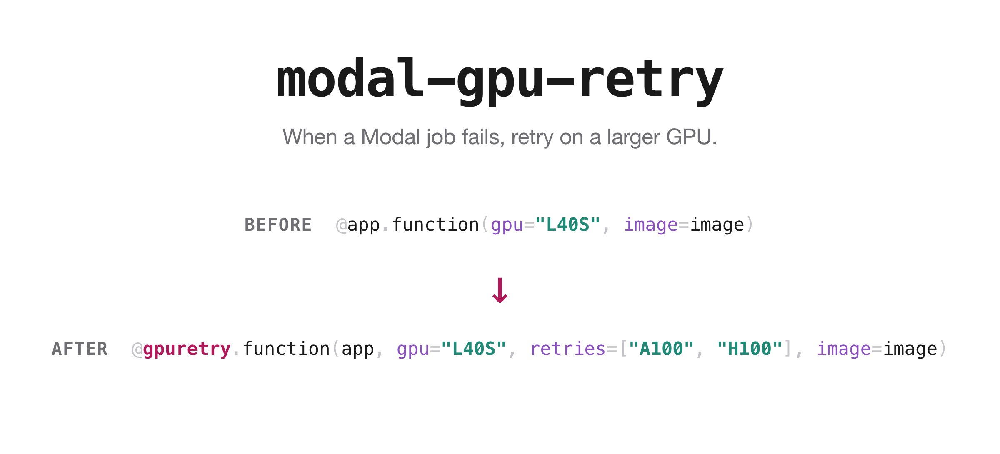
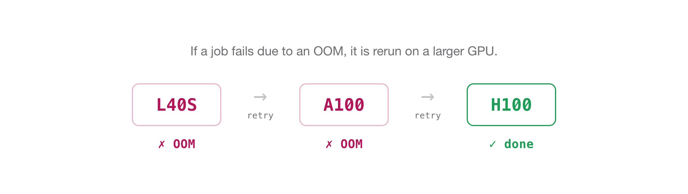

# modal-gpu-retry

<p align="center">
  
</p>


## Install

```bash
pip install modal-gpu-retry
```

You also need it inside your Modal image, since Modal imports your module in the
container:

```python
image = modal.Image.debian_slim().pip_install("torch", "modal-gpu-retry")
```

## Motivation

When running hundreds of vLLM jobs on Modal, I would often batch deploy these as independent jobs, and frustratingly some jobs would OOM and require me to tediously figure out the exact subset of all jobs that failed and rerun them manually. I looked into what features Modal had to resolve this, but their built-in retry feature, `retries`, which runs the job again if it fails, is ill-suited for OOM issues since it runs the job on the same hardware config.

I needed fallback functionality that escalated to larger GPUs when a job failed, so I made this lightweight package: `modal-gpu-retry`.

## Usage
All you have to do is change the decorator from
```python
@app.function(gpu="L40S", image=image)
```
to
```python
@gpuretry.function(app, gpu="L40S", retries=["A100", "H100"], image=image)
```

If the job fails on the L40S, it will then be run on the A100, then if it fails again, on the H100.

<p align="center">
  
</p>

### Example

Here's an example implementation.

```python
import modal
import modal_gpu_retry as gpuretry

app = modal.App("my-evals")
image = modal.Image.debian_slim().pip_install("torch", "modal-gpu-retry")

# before:  @app.function(gpu="L40S", image=image)
@gpuretry.function(app, gpu="L40S", retries=["A100", "H100"], image=image)
def run_eval(config):
    ...  # if this OOMs on L40S, it runs again on A100, then H100

@app.local_entrypoint()
def main():
    results = list(run_eval.map(configs))
```

The first attempt uses the `gpu=` you already set. Each failure moves to the next
GPU in the list. Run it the way you normally would, with `modal run evals.py`. It
works on `@gpuretry.cls` too, and `.remote`, `.map`, and `.starmap` keep working as they
did.

## Modal's `retries`

Modal already has a `retries` argument, but it reruns the job with the same
hardware configuration:

```python
@app.function(gpu="L40S", retries=3)
```

This is not helpful when jobs fail due to OOM, because rerunning the
same job on the same GPU just runs out of memory again. This package uses the same
argument but accepts a list of GPUs, and each retry uses the next one:

```python
@gpuretry.function(app, gpu="L40S", retries=["A100", "H100"])
```

So:

- `retries=3` behaves like normal Modal (rerun the same GPU).
- `retries=["A100", "H100"]` reruns on a bigger GPU each time.
- `retries=[]` is equivalent to `retries=0`.

If a job fails on all GPUs specified, you get a `LadderExhausted` back in the results
instead of an exception, so one bad job doesn't kill the batch:

```python
results = list(run_eval.map(configs))
dead = [c for c, r in zip(configs, results, strict=True)
        if isinstance(r, gpuretry.LadderExhausted)]
```

## Detached runs

`.remote`, `.map`, and `.starmap` run the retry loop in your process, so they stop
if you disconnect. `.spawn_map` runs the loop inside a lightweight CPU orchestrator
(dispatched as an independent Modal job) instead, so it keeps going after you close
your laptop:

```python
handle = run_eval.spawn_map(configs)
results = handle.get()   # later, or from a different process
```

To pick it back up elsewhere, pass the call id to `gpuretry.LadderCall.from_id(call_id)`.

## Using the Modal CLI

Run your script the normal way — escalation happens inside the `local_entrypoint`
when you call `.remote`, `.map`, or `.starmap`:

```bash
modal run evals.py
```

`modal deploy evals.py` works too, and is required before you use `.spawn_map`.

### Limitations

These Modal CLI patterns don't work as intended:

- `modal run evals.py::run_eval` — the CLI can't target the wrapped function directly; call it from a `local_entrypoint` instead.
- `modal run --detach evals.py` — keeps the app alive, but the retry loop for `.remote`, `.map`, and `.starmap` still stops when you disconnect; use `.spawn_map` for escalation that survives a disconnect.

See [the examples README](examples/README.md#modal-cli-details) for the full explanation.

## Notes

- `spawn_map` needs the app deployed (`modal deploy`), because the orchestrator
  looks up the target by name.
- Your class or function shows up in the Modal dashboard with a `_mgr_real_`
  prefix. That's how the wrapper keeps your call sites unchanged without breaking
  the way Modal loads your class inside the container.

## License

MIT. This is a community wrapper around the modal SDK and isn't affiliated
with Modal.
